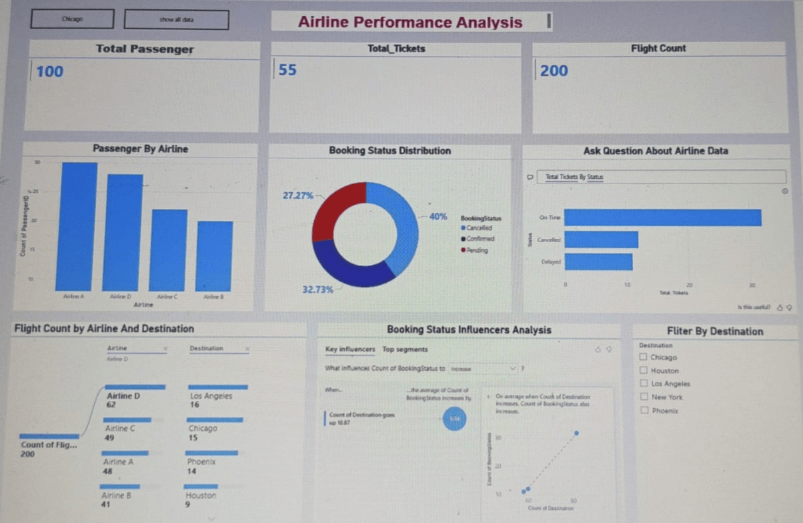

\# ✈️ **Airline Performance Analysis Dashboard**

\## 📊 **Project Description**

This project is a Power BI dashboard created to analyze airline performance data.

It helps to understand passengers, ticket bookings, and flight trends.

\---

\## 🎯 **Objectives**

\* Analyze passenger distribution across airlines

\* Understand booking status (Confirmed, Cancelled, Pending)

\* Analyze flight count by airline and destination

\---

\## 📈 **Dashboard Features**

\* Total Passenger, Total Tickets, Flight Count (KPI cards)

\* Passenger by Airline (Bar Chart)

\* Booking Status Distribution (Donut Chart)

\* Flight Count by Airline and Destination (Decomposition Tree)

\* Booking Status Influencers Analysis (Key Influencers)

\* Filter by Destination (Slicer)

\* Q\&A Visual for interactive queries

\---

\## 🛠️ **Tools Used**

\* Power BI

\* Excel

\---

\## 📸 **Dashboard Screenshot**

\---

\## 💡 **Key Insights**

\* Airline A has the highest number of passengers

\* Most tickets are confirmed compared to cancelled and pending

\* Flight distribution varies across destinations

\---

\## 📂 **Files in this Project**

\* Airline\_Dashboard.pbix-Power BI Report File

\* Dataset files (Excel)-Excel Source Data

\* Dashboard screenshot-Dashboard Preview

\---

\## 🚀 **Purpose of the Project**

This project was created to improve my practical skills in Power BI and data visualization, and to understand how to convert raw data into meaningful insights.

\---

